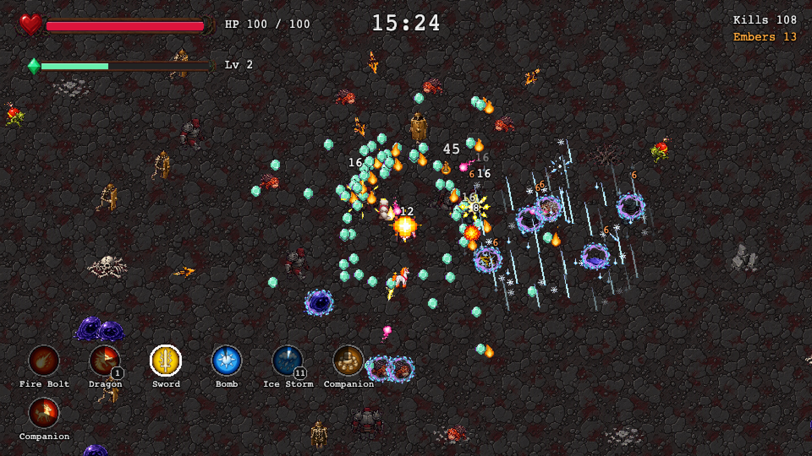
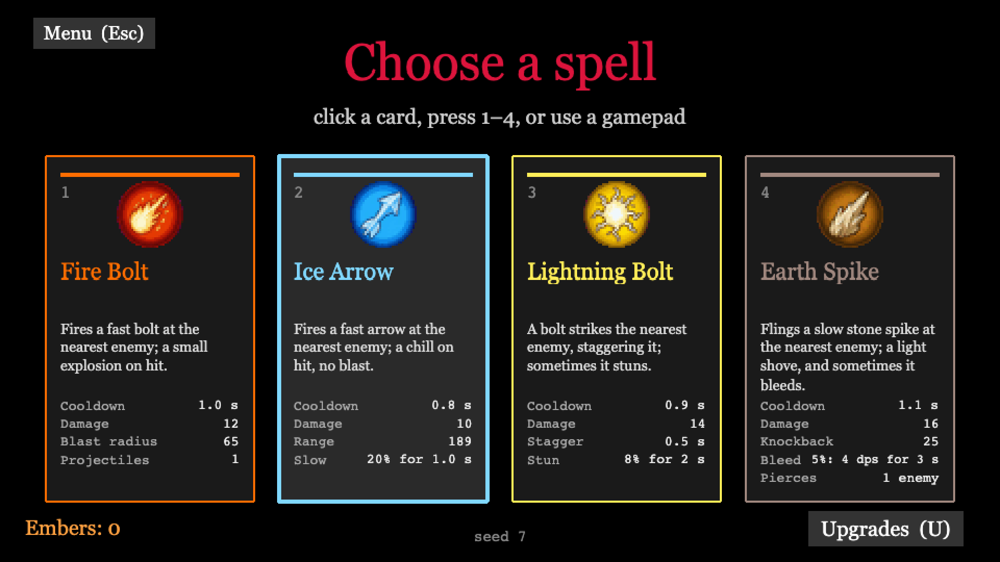
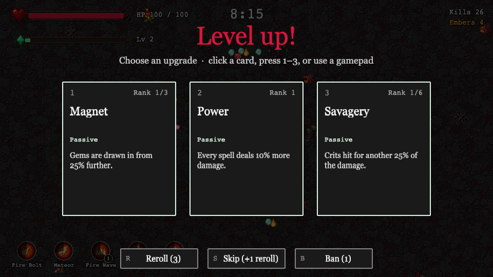
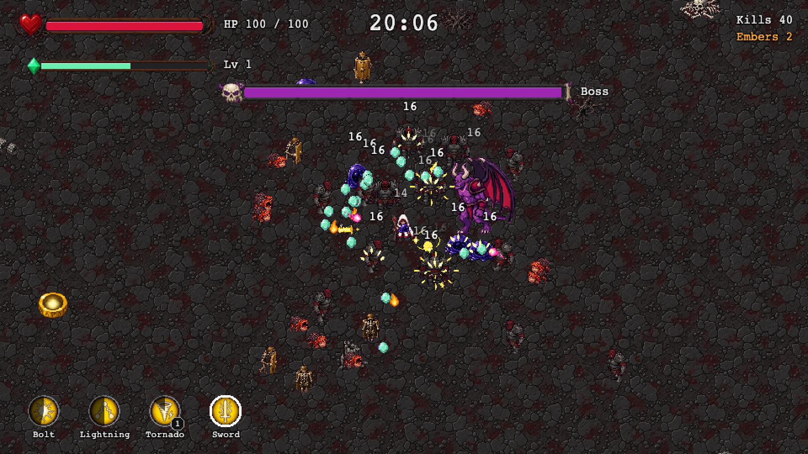
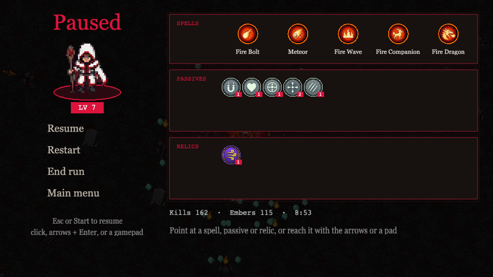
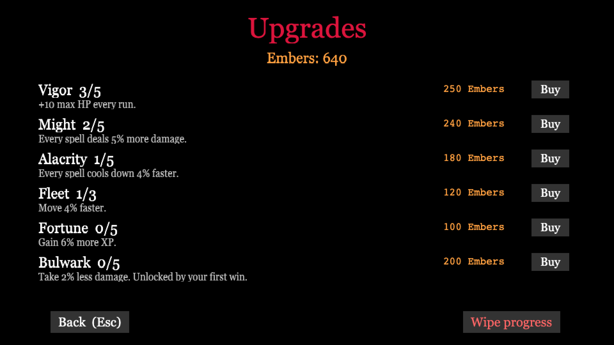

# Crimson Onslaught

[](https://github.com/danhquach/crimsononslaught/actions/workflows/ci.yml)
**Play the latest build:** <https://danhquach.github.io/crimsononslaught/>

A browser-based auto-battler "bullet heaven". You move; your spells fire on
their own. Survive twenty minutes of escalating waves, then bring down the boss.



| Pick a starting spell                                     | Level up: three cards, pick one                      | The boss at 20:00                        |
| --------------------------------------------------------- | ---------------------------------------------------- | ---------------------------------------- |
|  |  |  |

| Pause: the run's spells, passives and relics | Spend Embers on permanent upgrades              |
| -------------------------------------------- | ----------------------------------------------- |
|   |  |

The run shots use the `?loadout=` test switch (below), so they show more spells,
and more elements, than one run carries.

Built with [Phaser 3](https://phaser.io/), TypeScript, and Vite.

## Status

Playable end to end: menus, a full 20-minute run with every element's five
spells, the boss, and meta progression between runs. Open work — balance,
touch controls, more maps — is tracked as GitHub issues.

## The game

- **One run, twenty minutes.** One hero, one arena. Waves escalate on a fixed
  schedule and stop at 20:00, when the boss arrives: it chases, stands and
  flashes, then charges.
- **Pick an element.** The select screen offers each element's default spell —
  **Fire Bolt**, **Ice Arrow**, **Lightning Bolt** or **Earth Spike** — and the
  run stays in that element.
- **Three active slots.** The default spell fills the first; the second and
  third unlock at levels 2 and 5 and draw from the element's other four spells:

  | Element   | Default        | Other spells                                                   |
  | --------- | -------------- | -------------------------------------------------------------- |
  | Fire      | Fire Bolt      | Meteor, Fire Wave, Fire Companion, Fire Dragon                 |
  | Ice       | Ice Arrow      | Frost Nova Bomb, Ice Shield, Ice Companion, Ice Storm          |
  | Lightning | Lightning Bolt | Chain Lightning, Tornado, Lightning Companion, Lightning Sword |
  | Earth     | Earth Spike    | Boulder, Earth Shield, Earthquake, Earth Companion             |

- **Level-ups.** Each level draws three cards: new spells while a slot is open,
  then 14 ranked passives for the rest of the run (damage, cooldown, area,
  projectile speed, duration, crit, damage taken, move speed, max HP,
  regeneration, gem pull, XP, Pierce). **Reroll**, **Skip** (earns a reroll)
  and **Ban** reshape an offer.
- **Relics.** Eight relics lie around the arena. Touching one pauses the run
  on three cards, mostly relic buffs that last the rest of the run, sometimes
  extra rerolls or bans.
- **Enemies.** Swarm from the start, fast from 2:00 and tank from 4:00; ranged
  enemies from 6:00 keep their distance and shoot, exploders from 8:00 blow up on the player,
  splitters from 10:00 burst into three splitlings, and shielded enemies from
  12:00 block hits on their front. Nine elites join at set times: champions of
  a type already in the crowd, far tougher, marked by a gold rune circle, and
  each drops a chest.
- **Pickups.** XP gems, Embers, and rare consumables: health, a magnet that
  pulls every gem in, a bomb that blasts the screen, and the elites' chests,
  which pay out Embers.
- **Between runs.** Embers buy permanent upgrades in the **Upgrades** shop,
  reached from the spell select screen (max HP, damage, cooldown, move speed,
  XP; a first win unlocks less damage taken). **Profile** keeps a player name and lifetime stats,
  **Settings** holds master and music volume, mute, damage numbers, hit-stop
  and screen shake, and **Help** explains every pickup, lists what's new and
  sends feedback. Progress is saved in the browser.
- **In a run.** Esc (or Start on a pad) pauses on the build summary, with
  Resume, Restart, End run and Main menu. Closing the tab mid-run asks first.
- **Sound.** Synthesised and recorded sound effects, a menu theme, and a run
  track and a boss track drawn from two of each per run.

### Test and dev switches

URL parameters, read in the deployed build as well as in dev:

| Parameter           | Effect                                                            |
| ------------------- | ----------------------------------------------------------------- |
| `?seed=<n>`         | Reproduces a run exactly (on the same build and machine)          |
| `?timeScale=<n>`    | Multiplies the run clock                                          |
| `?startAt=<s>`      | Starts the run clock late, e.g. `?startAt=1190` for the boss      |
| `?invulnerable=1`   | Drops every hit, so an unattended run reaches the boss            |
| `?loadout=<ids>`    | Equips extra spells by id, e.g. `?loadout=fire_meteor,ice_shield` |
| `?enemies=<types>`  | Lets only those types spawn, e.g. `?enemies=ranged,tank`          |
| `?debug=textures`   | Plays every atlas animation in a labelled grid                    |
| `?debug=collisions` | Runs the collision pairs on their own                             |

## Controls

|                      | Keyboard / mouse                                  | Gamepad                                         |
| -------------------- | ------------------------------------------------- | ----------------------------------------------- |
| Move                 | WASD or arrow keys                                | Left stick (analog, deadzone 0.2) or D-pad      |
| Menus and overlays   | Click, or the number keys / Enter shown on screen | D-pad or left stick to select, **A** to confirm |
| Intro and its panels | Arrow keys to select, Enter to confirm, Esc back  | D-pad or left stick to select, **A** to confirm |

Both input sources are live at once, and a pad plugged in mid-run is picked up
without a reload. Mouse and keyboard stay primary: nothing is highlighted until
a gamepad is actually used.

## Getting started

Requires Node 20.19+ (or 22.12+).

```bash
npm ci
npm run dev        # local dev server (http://localhost:5173)
npm run build      # type-check + production build to dist/
npm run preview    # serve the production build locally
npm test           # unit tests (Vitest)
npm run test:e2e   # browser smoke tests (Playwright)
npm run lint       # type-check + ESLint + Prettier check
npm run format     # Prettier (write)
```

`test:e2e` starts its own Vite dev server and drives Chromium; the first run
needs the browser installed once with `npx playwright install chromium`.

The Help screen's feedback form posts to a form-to-email service and needs its
access key in `VITE_FEEDBACK_ACCESS_KEY` (copy `.env.example` to `.env`).
Without one the form says it is unavailable; the deploy build reads the key
from the `FEEDBACK_ACCESS_KEY` Actions secret.

## Project layout

```
src/config/   tunable data: spells and the four element rosters, loadout, passives, relics, meta (upgrades, milestones, currency), enemies, waves, boss, pickups, sounds, changelog, animations, FX
src/core/     pure game logic, no engine imports, unit-tested: run state, loadout, level-up and relic offers, spawn director, spell math, save schema and upgrade shop, HUD / pause / help view-models
src/scenes/   Boot, Intro, Settings, Profile, Help, SpellSelect, Upgrades, Game, HUD, LevelUp, Pause, Result, two dev-only debug scenes
src/entities/ Player, Enemy, Boss, Companion, XpGem, Pickup, Projectile, HomingProjectile, EnemyShot, Boulder, ShieldAura
src/spells/   one Phaser-side class per spell over its `src/core/` math, plus the damage sink
src/systems/  Phaser-side wrappers: spawn director, collisions, and the enemy / shot / gem / pickup / area / FX / overlay / damage-number pools
src/render/   texture-key layer: sprite atlas, animation playback, placeholder shapes as fallback; audio playback
src/storage/  the one `localStorage` adapter; core never imports it
scripts/      art pipeline (`npm run art:cut`) and audio pipeline (`npm run audio:gen`, `npm run audio:cut`)
e2e/          Playwright browser suites
docs/         design specs and plans, ticket list, tuning notes, art sheets + manifest, screenshots
```

## Rendering and the art pipeline

Nothing in the game references an image file. Every visual asks for a
**texture key** (`player`, `enemy_swarm`, `boss`, `gem`, `pickup_relic` and so
on), typed as `TextureKey` in `src/config/colors.ts`.

At boot, `src/render/atlas.ts` loads the sprite atlas and points each texture
key at a still frame from it; `src/render/textures.ts` then generates a
flat-colored placeholder shape for any key the atlas did not supply. So the
art can be migrated a key at a time, and the game still runs if the atlas
fails to load. No entity, spell, or scene code knows the difference — they
keep requesting the same keys.

Open `http://localhost:5173/?debug=textures` to page through every animation
in the atlas, labelled with its frame count and native size.

The hero, enemies, boss and gems play the atlas clips for what they are doing
(CO-081). Which clip — facing from the movement vector, hurt over walk, death
over everything — is decided in `src/core/animation.ts`, pure and unit-tested;
`src/render/animate.ts` plays it and re-centres the Arcade body on the frame's
anchor, so a frame of any size leaves the hitbox where the config's radius put
it. Spawn holds, hurt flashes and death clips run on the run clock, so a paused
run holds them and a missing atlas (one `[atlas]` warning) shortens them to
nothing.

The spells play their effects the same way (CO-082). One-shot bursts — the
fireball's cast flash and explosion, the nova pulse, the strike and impact of
a bolt, the boulder's impact and knockback dust — come from
`src/systems/FxPool.ts`, a pool of plain sprites that free themselves when
the clip ends. Status overlays — the flame on a burning enemy, the frost on a
slowed one, the block on a frozen one, the sparks on a stunned one — come from
`src/systems/OverlayPool.ts`, one per afflicted enemy, positioned from its
host every frame and freed when the status ends or the host dies; the pool is
capped at the enemy cap, and `GameScene.overlayCount` exposes the count to
the browser suite. A chain jump is a tiled `lightning.chain` strip stretched
between two enemies for one pass of the clip, cycled on the run clock. Which
overlay a status calls for, how big an effect is drawn for the live stats and
how a strip lies are `src/core/fx.ts`; the tunables are `src/config/fx.ts`.

### Regenerating the atlas

```
npm run art:cut
```

Reads every authored sheet `docs/art/sheets/manifest.json` names (source of
truth, not shipped) and writes one `public/assets/atlas/props*.png` + `.json` pair per
atlas page, plus the generated `src/config/frames.ts`. The run is
deterministic: the same sheets always produce byte-identical output, so a
re-run with nothing changed leaves a clean working tree.

Every frame keeps one native px of clear space on all four sides, so no art is
shaved flat against its own boundary. The margin is added after the
downscale, and the run fails, naming the frame, if any frame on a written page
still has art touching its edge; `npm test` checks the shipped pages the same
way. Size or tile anything from its art with the clip's `ART_BOXES` entry in
`src/config/frames.ts`, not the frame's `w`/`h`, which include the margin.

The manifest's grid (`cols`, `rows`, `sheetCell`) is authoritative, not the
canvas size a prompt asked for: sheets rarely come back at the asked size, and
each prompt doc records what was actually delivered. Before cutting, the run
checks that every file the manifest names exists, that its PNG or JPEG
signature matches its extension, and that no same-named file in another format
sits beside it; `npm test` runs the same check.

A sheet's `page` in the manifest says which page its frames are packed into
(1 by default), and each page is packed, quantised and held under 400 KB on
its own — which is what makes room for a roster bigger than one page. A page
carries its own 256-colour palette, so moving a sheet between pages shifts
exact pixel colours on both pages; nothing may assert an atlas colour it did
not read from the loaded texture.

`docs/art/sheets/manifest.json` is the single place that maps grid cells to
animation frames — which sheet, how many columns and rows, and what each row
holds. The script never hardcodes a sheet, so new art only needs a manifest
entry. It fails loudly, naming sheet/row/column, when a cell declared blank
holds art, a declared frame is empty, or art runs off a cell edge without the
row declaring `allowEdge`.

The cut itself lives in `scripts/lib/spriteCut.mjs` as pure functions over
RGBA buffers, unit-tested on synthetic pixel buffers in `spriteCut.test.mjs`.
`src/config/animations.ts` holds the animation list as pure data, cross-checked
against both the manifest and the generated atlas by `animations.test.ts`, so
the three cannot drift apart.

## Audio

Every clip lives in `public/assets/audio/`, keyed by `src/config/sounds.ts`.
`npm run audio:gen` synthesises the effects and music loops from the recipes in
`scripts/gen-audio.mjs` and `scripts/lib/music.mjs`, byte-for-byte
reproducibly. A few effects are recorded clips instead: `npm run audio:cut --
<dir>` checks each original against its pinned hash and cuts it to game length
(needs ffmpeg on the PATH). Licences are in `public/assets/audio/CREDITS.md`.

## CI and deployment

Every pull request runs `npm run lint`, `npm test`, `npm run build`, and the
Playwright smoke suite (`npm run test:e2e`) in GitHub Actions
(`.github/workflows/ci.yml`); a failed smoke run uploads its HTML report as a
workflow artifact. Pushes to `main` additionally
deploy `dist/` to GitHub Pages at the URL above. The deploy job needs the
repository's Pages source set to **GitHub Actions** (Settings → Pages); the
lint/test/build job does not depend on it.

## Documentation

- Design spec (Phase 1): [`docs/superpowers/specs/2026-09-14-phase1-design.md`](docs/superpowers/specs/2026-09-14-phase1-design.md)
- Design spec (Phase 2 — loadout, passives, spell roster): [`docs/superpowers/specs/2026-09-18-phase2-spells.md`](docs/superpowers/specs/2026-09-18-phase2-spells.md)
- Design spec (the 20-minute run — pickups, relics, Embers): [`docs/superpowers/specs/2026-09-23-twenty-minute-run-design.md`](docs/superpowers/specs/2026-09-23-twenty-minute-run-design.md)
- Spell reworks: [Meteor](docs/superpowers/specs/2026-09-26-meteor-rework-design.md), [Frost Nova Bomb](docs/superpowers/specs/2026-09-28-frost-nova-bomb-rework-design.md)
- Tuning notes: [`docs/tuning/`](docs/tuning/)
- Ticket list: [`docs/tickets/phase1-tickets.md`](docs/tickets/phase1-tickets.md)
- Contributor workflow rules: [`CLAUDE.md`](CLAUDE.md)

## Contributing

One branch per issue, merged via pull request only. See `CLAUDE.md` for the
full workflow and the public-repo data rules.

## License

MIT — see [LICENSE](LICENSE).
